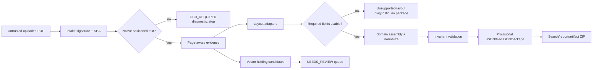

# Airport-OCR proof-of-concept design

**Status:** multi-layout native-text increment · non-operational
**Flow:** `PDF → Extract → Identify → Structure → Search`
**Case studies:** VOBL regression + supplied VOMM/Chennai layout

> This is research tooling, not authoritative aeronautical data and not for navigation.

## 1. Implemented scope

1. controlled intake: media signature, SHA-256, extension mismatch, optional
   content-addressed quarantine, rights/malware state recording;
2. page-aware PyMuPDF word-dump adapter (PyMuPDF stays outside core runtime);
3. deterministic chart/title, ARP, elevation, runway-row, explicit-dimension,
   taxiway-legend/reference adapters;
4. dynamic reciprocal runway pairing for arbitrary valid 01–36 L/R/C ends;
5. exact DMS→CRS84 normalization with source text preserved;
6. airport-independent domain validation and explicit partial/blocker states;
7. normalized JSON, RFC 7946 GeoJSON, search, package, Markdown/HTML report;
8. page-qualified black-linework holding candidates (`NEEDS_REVIEW`);
9. dynamic offline stdlib web app;
10. generated upload-first Colab with an optional VOBL sample profile and a full
    artifact ZIP.

## 2. Not implemented/claimed

- operational/authoritative use;
- universal layout coverage;
- OCR for textless/scanned PDFs;
- complete map-label taxiway inventory when no structured legend/table exists;
- accepted holding positions or surveyed runway polygons;
- automatic conflict resolution or human-review approval;
- source licensing approval or malware scanning.

## 3. Package structure

```text
src/airport_ocr/
├── intake.py         untrusted source manifest/quarantine
├── pdf_words.py      page-aware native-text adapters + diagnostics
├── coordinates.py    exact DMS and reciprocal runway helpers
├── pipeline.py       invariant validation + normalized JSON/GeoJSON
├── validation.py     PASS/FAIL/EXPECTED_BLOCKER/INFO
├── holding.py        all-page review-only vector candidates
├── search.py         GeoJSON filters
├── report.py         package, deterministic/AI prompt, escaped HTML
├── webapp.py         stdlib API
├── webui.py          dynamic self-contained browser UI
├── cli.py            command boundary
└── __main__.py
```

## 4. Trust/capability flow



Source/chart/AI text never controls execution. Dynamic values are escaped before
HTML. No profile can inject values into a non-matching ICAO.

## 5. Data rules

- Page identity and source word coordinates are retained at extraction.
- Required: unique ICAO, ARP DMS pair, elevation claim, ≥1 complete reciprocal
  runway pair and both threshold positions.
- Optional physical dimensions, TDZ elevation, taxiway widths/inventory, and
  holding geometry may remain blocked/candidate-grade.
- TORA/TODA/ASDA/LDA never fill physical runway dimensions.
- One elevation claim is `SINGLE_SOURCE`; differing claims remain unresolved
  with no selection.
- GeoJSON uses RFC 7946 longitude/latitude. Runway lines are labelled threshold
  connectors, not surveyed extents.
- Empty unextracted collections are `NOT_EXTRACTED_NOT_ABSENT`.

## 6. Extractor extension contract

Future native-text/OCR/CV adapters emit source candidates, not canonical facts:

```json
{
  "extractor": {"name": "provider", "version": "pinned"},
  "source_document_id": "sha256:...",
  "page": 0,
  "source_bbox": [0, 0, 100, 20],
  "source_text": "07",
  "candidate_type": "runway_direction",
  "candidate_value": "07",
  "confidence": {"text": 0.99, "classification": 0.98},
  "status": "RAW_OBSERVATION"
}
```

Adapters cannot mark outputs authoritative or bypass validation/review.

## 7. Interfaces

- `airport-ocr intake`
- `airport-ocr extract-pdf-words` (`--profile auto` by default, optional metadata)
- `airport-ocr process`
- `airport-ocr search`
- `airport-ocr serve`
- `notebooks/Airport_OCR_Full_Pipeline.ipynb` generated by
  `scripts/build_full_pipeline_notebook.py`

## 8. Acceptance for this increment

- VOBL regression output remains stable;
- VOMM-shaped text extracts VOMM/Chennai, ARP/elevation, 07/25 + 12/30, explicit
  dimensions/thresholds, and taxiway candidates without VOBL contamination;
- no TDZ column yields blockers, not invented values;
- scanned/native-text-empty input stops with an OCR-required diagnostic;
- uploaded filenames and outputs are generic/SHA-qualified;
- full test suite passes; core retains zero runtime dependencies;
- all output remains provisional and non-operational.

See [`MULTI_AIRPORT_DESIGN.md`](MULTI_AIRPORT_DESIGN.md) for detailed algorithms
and [`../research/MULTI_AIRPORT_EXTRACTION_RESEARCH.md`](../research/MULTI_AIRPORT_EXTRACTION_RESEARCH.md)
for standards/research rationale.
