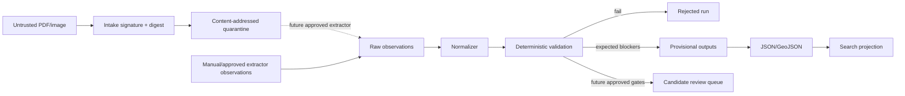

# Airport OCR Proof-of-Concept Design

**Status:** Phase 2 foundation; non-operational  
**Primary flow:** Source intake → candidate observations → deterministic normalization → validation → JSON/GeoJSON → search  
**Current source:** provisional VOBL bootstrap observations; the official PDF and rights approval remain external blockers

## 1. Goals

The proof of concept turns the verified Phase 1 script into a reusable Python package and CLI. It provides the safe parts of the target workflow now, while defining replaceable boundaries for PDF, OCR, and computer-vision extractors later.

Implemented capabilities:

1. inspect and register a local PDF or image without treating it as trusted;
2. compute SHA-256, identify media type from file signatures, and optionally copy bytes into a content-addressed quarantine directory;
3. preserve chart identity, retrieval, rights, and malware-scan state in a source manifest;
4. normalize source-preserving airport/runway observations;
5. parse DMS coordinates deterministically and export CRS84 longitude/latitude;
6. validate ICAO, reciprocal runway designators, dimensions, elevation claims, and incomplete-collection semantics;
7. preserve conflicting source claims without silently selecting one;
8. generate normalized JSON, GeoJSON, validation, and reproducibility manifests;
9. search generated GeoJSON by feature type, designator, airport, and bounding box.

Not implemented or claimed:

- authoritative or operational aeronautical data;
- OCR accuracy;
- semantic PDF-vector interpretation;
- complete taxiway or runway-holding extraction;
- georeferenced surface geometry;
- automated human-review approval;
- source licensing approval;
- malware scanning (the CLI records external scanner state but does not pretend to scan).

## 2. Package structure

```text
src/airport_ocr/
├── __init__.py       public package metadata
├── __main__.py       `python -m airport_ocr`
├── cli.py            command-line boundary
├── coordinates.py    DMS and runway-designator domain helpers
├── intake.py         source signature, digest, quarantine, and manifest
├── pipeline.py       normalization and export orchestration
├── search.py         small GeoJSON search projection
└── validation.py     structured validation results
```

## 3. Commands

### `airport-ocr intake`

Input is untrusted. The command streams the file to compute a digest, inspects magic bytes, records extension mismatches, and optionally stores a verified byte-for-byte copy in `quarantine/<sha256>.<ext>`. Existing content-addressed files are never overwritten with different bytes.

A file entering quarantine is not approved for parsing or publication. The manifest records `malware_status`, `rights_status`, and `operational_use=false` independently.

### `airport-ocr process`

Consumes source-preserving observation JSON, not arbitrary model output. It validates and normalizes supported airport/runway fields, writes deterministic outputs, and leaves unsupported/incomplete collections explicitly blocked. `--fail-on-blockers` lets automated workflows reject provisional runs.

### `airport-ocr search`

Queries a generated GeoJSON projection. This demonstrates search semantics without introducing a second source of truth. It supports attribute and bounding-box filters and returns another FeatureCollection.

## 4. Trust boundaries



Document content never controls tool execution. Intake does not execute JavaScript, attachments, embedded commands, or external references. Future parser/OCR workers must run in isolated, resource-limited environments.

## 5. Data rules

- Source DMS strings are retained alongside parsed components and decimal output.
- GeoJSON is RFC 7946 longitude/latitude (`OGC:CRS84`).
- Elevation remains an attribute with value, unit, meaning, vertical datum, source, and status.
- A connector between reciprocal thresholds is labelled as a derived connector, not a surveyed runway extent.
- Empty taxiway or holding arrays must include `NOT_EXTRACTED_NOT_ABSENT` when features are visible but extraction is blocked.
- A conflict contains multiple claims and no `selected_value` until adjudicated.
- Expected source/rights/completeness blockers remain visible and can be promoted to strict failures by policy.

## 6. Extractor extension contract

Future native-PDF, OCR, and CV adapters should implement an observation-provider boundary rather than write canonical data directly. Each candidate must supply:

```json
{
  "extractor": {"name": "provider", "version": "pinned-version", "configuration_digest": "..."},
  "source_document_id": "...",
  "page": 1,
  "source_bbox": [0, 0, 100, 20],
  "source_text": "09L",
  "candidate_type": "runway_direction",
  "candidate_value": "09L",
  "confidence": {"text": 0.99, "classification": 0.98},
  "status": "RAW_OBSERVATION"
}
```

Adapters may propose observations but cannot mark them authoritative or bypass validation/review.

## 7. Next implementation increments

Once source and governance blockers close:

1. add a sandboxed PyMuPDF native text/vector adapter;
2. add an independent PDF parser for differential checks;
3. add Tesseract multi-DPI OCR behind the observation contract;
4. add provider-neutral managed OCR adapters only when approved;
5. add page-space evidence crops and a reviewer UI;
6. add PostGIS persistence and OGC API Features;
7. benchmark complete taxiway and holding-position recall/precision;
8. add bitemporal accepted-feature versions and atomic airport releases.

## 8. Acceptance for this increment

- package installs without runtime dependencies;
- CLI runs through `python -m airport_ocr` and installed entry point;
- intake creates a digest/provenance manifest and never claims to malware-scan;
- VOBL fixture processing reproduces verified normalized coordinates and conflict state;
- generated GeoJSON remains explicitly provisional;
- search returns only matching features;
- tests pass on Python 3.10+;
- documentation and historical Phase 0/1 evidence are committed with the code.
