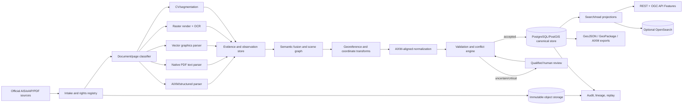

# Enterprise Aerodrome Chart Extraction and Search

**Case study:** Kempegowda International Airport, Bengaluru (VOBL)  
**Target flow:** PDF → Extract → Identify → Structure → Validate → Search  
**Research date:** 2026-08-19  
**Input reviewed:** attached AIP India VOBL aerodrome-chart image  
**Status:** architecture and implementation plan; preliminary chart observations are not navigation-authorized data

> **Safety notice:** Data extracted from a chart by software must not be treated as authoritative operational aeronautical data merely because it looks correct. For safety-critical or operational use, every released value must be reconciled with the responsible Aeronautical Information Service (AIS), its effective AIRAC publication, declared quality requirements, and an approved review process. This document is for solution design and evaluation, not navigation.

## 1. Executive summary

An enterprise solution should not be an OCR script. Aerodrome charts combine tables, small and rotated text, symbols, line styles, complex vector geometry, overlapping features, and temporal aviation information. A reliable system must preserve the source, extract multiple kinds of evidence, understand aviation entities and topology, detect conflicts, retain every version, and route uncertain or safety-significant results to qualified reviewers.

The recommended solution is a **hybrid, provenance-first pipeline**:

1. Acquire and preserve the original publication, checksum, rights, chart identity, publication/effective dates, and AIRAC context.
2. Prefer official digital sources—AIXM, aerodrome-mapping data, or structured eAIP tables—over reconstructing geometry from a drawing.
3. Inspect each PDF and route native text, vector graphics, raster images, and mixed regions through different extractors.
4. Combine deterministic PDF parsing, OCR/document AI, computer vision, aviation rules, and optional vision-language assistance.
5. Store all raw observations and alternatives with page coordinates, extractor versions, confidence, and evidence crops.
6. Normalize accepted features into an AIXM-aligned, bitemporal model in PostgreSQL/PostGIS.
7. Apply schema, coordinate, geometric, topological, semantic, cross-source, and temporal validation.
8. Require aviation-qualified human approval based on feature risk and uncertainty.
9. Publish searchable read models through REST and OGC API Features; generate GeoJSON/GeoPackage for general GIS and AIXM/GML for aviation interchange.

**Recommended enterprise stack:** immutable object storage + event/workflow orchestration + sandboxed PDF services + pluggable OCR + OpenCV/ML extraction + GDAL/PROJ + PostgreSQL/PostGIS + a reviewer application + REST/OGC APIs. Add OpenSearch only if fuzzy text, faceting, or large-scale combined text/geo discovery justifies another index.

## 2. Requested scope

### 2.1 Features to extract

Only these domain objects are in scope:

1. **Airport** — identity and airport feature, including ICAO identifier and name.
2. **Runways** — runway identity, paired directions, dimensions, surfaces/centrelines where recoverable, threshold positions, and relevant elevations.
3. **Taxiways** — designation, centreline and/or surface geometry, width where stated, and connectivity.
4. **Runway holding positions** — operational holding position, associated taxiway/runway, and the actual holding-marking line where recoverable.
5. **Airport coordinates/elevation** — Aerodrome Reference Point (ARP), coordinate reference information, and aerodrome elevation.

Objects such as buildings, roads, car parks, fire stations, radio frequencies, aprons, stands, lighting systems, navigation aids, and airport boundaries may be processed as contextual evidence but must not appear in the requested product unless later added to scope.

### 2.2 Required outcomes

- Machine-readable, versioned structured data.
- Spatial and attribute search.
- Field-level source traceability.
- Explicit confidence and review status.
- Repeatable processing of new chart editions.
- Change detection between publication cycles.
- Export in consumer-friendly and aviation-compatible formats.

### 2.3 What the system must not do

- Invent unreadable labels or coordinates.
- Infer surveyed precision from line thickness on a chart.
- silently replace one conflicting source with another.
- Store latitude/longitude without CRS and axis-order semantics.
- Collapse every holding position into an unexplained point when the painted marking is a line.
- Overwrite historical features when a new chart becomes effective.
- Allow a generic LLM/VLM response to bypass deterministic validation and review.

## 3. Supplied VOBL chart: preliminary observations

The attached image was incorporated into this assessment. It appears to be:

- **Publisher context:** AIP India; compiled and published by BIAL.
- **Chart:** AD 2 VOBL 1-101.
- **Chart date:** 27 NOV 2025.
- **Aeronautical information date:** AUG 2025.
- **Amendment:** AMDT 06/2025.
- **Airport:** Kempegowda International Airport Bengaluru.
- **ICAO:** VOBL.

The message did not include a directly downloadable original PDF URL. The attachment available for review is a rasterized chart image. A production extraction—particularly the complete taxiway and holding-position inventory—requires the original PDF or a full-resolution source render.

### 3.1 Preliminary airport observation

| Field | Value seen on chart | Status |
|---|---:|---|
| ICAO | VOBL | Visually legible; verify against original publication |
| Name | Kempegowda International Airport Bengaluru | Visually legible |
| ARP latitude | 13°11′56″N | Visually legible |
| ARP longitude | 077°42′20″E | Visually legible |
| ARP decimal latitude | 13.1988889 | Derived from displayed DMS |
| ARP decimal longitude | 77.7055556 | Derived from displayed DMS |
| AD elevation | 3003 ft | Chart observation; source conflict noted below |

The current AAI eAIP search result for the VOBL AD 2.1 text reports the same ARP but an aerodrome elevation of **3001 ft**. The supplied chart shows **3003 ft**. The system must preserve both claims with their source editions, validity, and retrieval dates, then create a review task. It must not average them or silently select one.

### 3.2 Preliminary runway observations

Both runway surfaces are labelled **4000 m × 45 m** on the supplied chart.

| Runway direction | Displayed direction | Threshold coordinate | Decimal coordinate (derived) | THR elevation | TDZ elevation | Type shown |
|---|---:|---|---|---:|---:|---|
| 09L | 092° | 13°12′25.26″N, 077°41′09.86″E | 13.2070167, 77.6860722 | 3003 ft | 3003 ft | ILS CAT-I |
| 27R | 272° | 13°12′24.65″N, 077°43′22.69″E | 13.2068472, 77.7229694 | 2919 ft | 2937 ft | ILS CAT-I |
| 09R | 092° | 13°11′23.04″N, 077°41′23.92″E | 13.1897333, 77.6899778 | 2973 ft | 2973 ft | ILS CAT-III |
| 27L | 272° | 13°11′21.92″N, 077°43′26.34″E | 13.1894222, 77.7239833 | 2964 ft | 2965 ft | ILS CAT-III |

Interpretation:

- `09L/27R` is one reciprocal runway pair.
- `09R/27L` is the second reciprocal runway pair.
- Decimal coordinates are transformations of the displayed DMS values, not separately authoritative measurements.
- Exact source glyphs, direction precision, units, and values must be re-read from the original PDF before acceptance.

### 3.3 Taxiways and runway holding positions

The chart and its runway-marking insets visibly contain taxiway identifiers and holding-position markings. However, a complete list cannot be extracted safely from the downscaled attachment without guessing small labels. Therefore:

```yaml
taxiways:
  extraction_status: requires_original_pdf
  preliminary_publication_status: blocked
runway_holding_positions:
  extraction_status: requires_original_pdf
  preliminary_publication_status: blocked
reason: Small labels and marking associations are not reliably legible in the supplied raster preview.
```

This is the correct enterprise behavior: represent incomplete work explicitly rather than fabricate completeness.

## 4. Why the problem is difficult

### 4.1 A PDF is not a GIS database

A PDF contains drawing instructions. A green curve may be a taxiway edge, centreline, lighting line, clipping path, or decorative element. A runway may be made from hundreds of unrelated path segments. Labels may be individual glyphs with no usable Unicode map. Drawing order and proximity do not guarantee semantic association.

### 4.2 Aerodrome charts are hybrid documents

One page may contain:

- native searchable text;
- text converted to vector outlines;
- raster scans;
- vector lines and Bezier curves;
- embedded images;
- tables;
- rotated labels;
- repeated runway-marking insets;
- legends and symbols that resemble real features;
- non-scale or schematic portions.

A single OCR pass cannot recover this structure reliably.

### 4.3 Aviation data is temporal

Publication date, effective date, source retrieval date, and actual operational validity are different concepts. A baseline may be modified by amendments, supplements, or temporary notices. AIRAC uses coordinated effective cycles. Data must therefore be versioned, not updated in place.

### 4.4 Coordinates have hidden semantics

`EPSG:4326` GML axis conventions and GeoJSON coordinate order can differ in practice. The model must distinguish:

- latitude/longitude display strings;
- normalized numeric coordinates;
- source CRS and axis order;
- horizontal accuracy;
- transformation method;
- elevation unit;
- height/elevation type;
- vertical datum and geoid information;
- vertical accuracy.

### 4.5 Holding positions have two related representations

An operational holding position may be modeled as a point or conceptual location, while the actual runway-holding marking is a line across a taxiway. Store these as related but distinct entities. This prevents loss of spatial detail and aligns better with aerodrome-mapping requirements.

## 5. Source strategy and precedence

The cheapest and most reliable extraction is often not PDF extraction at all. Use this precedence order:

| Priority | Source | Treatment |
|---:|---|---|
| 1 | Responsible AIS/aerodrome official digital data set, AIXM, or licensed AMDB | Preferred canonical candidate after validation |
| 2 | Official structured eAIP XML/HTML/table | Preferred for textual attributes; geometry may still need another source |
| 3 | Original vector PDF from the official publisher | Parse native text and graphics; retain PDF evidence |
| 4 | Official high-resolution raster/scan | OCR + CV + georeferencing + review |
| 5 | Trusted secondary data | Cross-check only unless licensing and authority permit more |
| 6 | Unverified web/image source | Triage or discovery only; never automatic authority |

For every source, capture:

- publisher and responsible organization;
- canonical URL or delivery channel;
- document identifier, chart type, page, edition, and amendment;
- publication and effective dates/AIRAC cycle;
- retrieval timestamp;
- SHA-256 digest and immutable object URI;
- media type and file size;
- license, redistribution, retention, and display restrictions;
- supersession relationship;
- malware-scan result;
- parser/render status.

The official AAI eAIP VOBL textual entry is discoverable at [AAI AIM India VOBL AD 2.1](https://aim-india.aai.aero/eaip-v2/eAIP/EC-AD-2.1VOBL-en-GB.pdf). Automated access and redistribution must follow the publisher's current terms; public accessibility alone does not establish reuse rights.

## 6. Standards and interoperability

### 6.1 ICAO information framework

- [ICAO Aeronautical Information Management](https://www.icao.int/airnavigation/aeronautical-information-management) describes the transition from product-based AIS to data-centric AIM and the role of PANS-AIM.
- ICAO Annex 4 addresses aeronautical charts; Annex 14 defines aerodrome concepts; Annex 15 and PANS-AIM address aeronautical-information management and digital data. Obtain licensed/current editions for formal compliance work.
- [ICAO AIRAC information](https://www.icao.int/airnavigation/airac) underpins effective-cycle handling.

Implication: chart extraction creates claims about aeronautical features; it does not automatically create an authoritative aeronautical data set.

### 6.2 AIXM

[AIXM](https://www.aixm.aero/) is the international exchange model for aeronautical information. [AIXM 5.1/5.1.1](https://www.aixm.aero/page/aixm-51-511) is the practical production reference for this design. [AIXM 5.2 change work](https://ext.eurocontrol.int/aixm_confluence/display/AIXM52CP) should be monitored, and the implementation should isolate version-specific mappings.

Relevant concepts include:

- `AirportHeliport` and aerodrome reference position;
- `Runway`, `RunwayDirection`, and runway centreline/threshold points;
- `Taxiway` and `TaxiwayElement`;
- taxi holding positions;
- stable feature identities and time slices;
- GML geometries and explicit CRS.

The internal schema should be **AIXM-aligned**, not a direct one-table copy of XML. Preserve source AIXM identifiers and raw payloads when ingesting AIXM, then provide loss-aware export mappings.

### 6.3 OGC and general GIS delivery

- [OGC API Features](https://ogcapi.ogc.org/features/overview.html) is suitable for web feature access.
- [OGC GeoPackage](https://docs.ogc.org/is/12-128r19/12-128r19.html) is useful for portable/offline delivery.
- [RFC 7946 GeoJSON](https://www.rfc-editor.org/rfc/rfc7946.html) is convenient for web clients but is a lossy view of AIXM temporality and relationships.
- [EPSG](https://www.epsg.org/) and [PROJ](https://proj.org/en/stable/operations/index.html) should govern CRS definitions and transformations.

Generate GeoJSON as a delivery projection with longitude/latitude order. Do not use an unexplained third ordinate for aviation elevation.

### 6.4 Provenance and quality

- [W3C PROV-O](https://www.w3.org/TR/prov-o/) provides useful provenance concepts.
- [ISO 19157-1:2023](https://www.iso.org/standard/78900.html) provides a general geographic-data-quality framework.

Use these concepts pragmatically even if full conformance is not initially required.

## 7. Solution approaches

### Approach A — Acquire official structured data

**Method:** License or obtain AIXM/aerodrome-mapping data or structured eAIP values and map them into the canonical model.

**Strengths:** highest semantics and coordinate quality; less reverse engineering; clear identities and validity.  
**Weaknesses:** availability, licensing, jurisdiction differences, integration complexity, and possible coverage gaps.  
**Use when:** available from the responsible source.  
**Recommendation:** always investigate first.

### Approach B — Native PDF text and vector parsing

**Method:** inspect fonts, text matrices, path operators, stroke/fill styles, clipping, images, and transforms. Cluster primitives and use legend/style/topology rules.

**Candidate tools:** [Apache PDFBox](https://pdfbox.apache.org/), [PyMuPDF](https://pymupdf.readthedocs.io/), pypdf, and hardened renderers.

**Strengths:** deterministic; preserves native coordinates and curves; fast; no OCR error for mapped text.  
**Weaknesses:** PDF objects lack aviation semantics; text may be outlines; paths may be fragmented; publisher templates vary.  
**Use when:** chart is digitally generated.  
**Recommendation:** primary PDF branch.

### Approach C — Raster OCR/document AI

**Method:** render selected regions at controlled DPI, deskew and enhance, then perform OCR/layout analysis at multiple scales and rotations.

**Managed candidates:** [Amazon Textract layout](https://docs.aws.amazon.com/textract/latest/dg/layoutresponse.html), [Azure Document Intelligence Layout](https://learn.microsoft.com/en-us/azure/ai-services/document-intelligence/prebuilt/layout?view=doc-intel-4.0.0), and [Google Enterprise Document OCR](https://cloud.google.com/document-ai/docs/enterprise-document-ocr).

**Strengths:** rapid baseline; handles scans; scalable managed options; useful confidence and bounding polygons.  
**Weaknesses:** small/rotated text and leader associations remain difficult; vendor confidence is not safety calibration; line art is not recovered by OCR.  
**Use when:** text is rasterized, missing, or malformed.  
**Recommendation:** pluggable fallback and benchmark target, not the complete solution.

### Approach D — Classical computer vision

**Method:** use color/style separation, morphology, line/contour detection, skeletonization, connected components, and graph construction. OpenCV documents [morphological line extraction](https://docs.opencv.org/4.x/dd/dd7/tutorial_morph_lines_detection.html) and [line-segment detection](https://docs.opencv.org/4.x/db/d73/classcv_1_1LineSegmentDetector.html).

**Strengths:** explainable, deterministic, inexpensive, and effective for regular markings.  
**Weaknesses:** sensitive to scale, scan quality, publisher palette, and occlusion.  
**Use when:** runway edges, centrelines, markings, and regular symbols have stable visual rules.  
**Recommendation:** use alongside vector parsing and learned models.

### Approach E — Learned detection/segmentation

**Method:** train or fine-tune models for runway surfaces, taxiway surfaces/centrelines, labels, and holding-position symbols/lines. Promptable segmentation can accelerate annotation.

**Strengths:** tolerates visual variability better than fixed rules.  
**Weaknesses:** requires representative labels, strong evaluation, drift controls, and post-processing; boundaries and small objects remain hard.  
**Use when:** processing volume and template diversity justify training.  
**Recommendation:** introduce after a gold data set and deterministic baseline exist.

### Approach F — Vision-language/foundation models

**Method:** ask a multimodal model to classify regions, interpret a legend, suggest labels, or assist reviewers; require constrained JSON and deterministic checks.

**Strengths:** flexible for unfamiliar layouts and triage.  
**Weaknesses:** may invent values, is not pixel-precise, and may be nondeterministic.  
**Use when:** assisting annotation, exception handling, or candidate generation.  
**Recommendation:** never the sole authority for coordinates, topology, or publication.

### Approach G — Manual digitization

**Method:** aviation/GIS specialists manually identify and trace features with dual review.

**Strengths:** best handling of rare ambiguity and low-volume work.  
**Weaknesses:** expensive, slow, inconsistent without tooling, and difficult to scale.  
**Use when:** safety significance or document quality blocks automation.  
**Recommendation:** retain as the review and exception path.

### Recommended combination

Use **A + B + C + D**, add **E** as data matures, restrict **F** to assistance, and retain **G** for qualified acceptance. The objective is not maximum automation; it is minimum cost per **correctly accepted airport edition** at a defined risk level.

## 8. Reference architecture



### Architectural principles

1. **Evidence is immutable.** Corrections create new decisions or versions.
2. **Observations are not canonical facts.** Multiple conflicting observations may coexist.
3. **Canonical features are bitemporal.** Operational validity and system knowledge are separate.
4. **Search indexes are projections.** PostGIS remains the source of truth.
5. **Every accepted field is explainable.** A reviewer can open the exact source page/crop.
6. **Components are replaceable.** OCR and ML providers use a common result contract.
7. **No silent degradation.** Missing source pages, low confidence, or incomplete batches block publication.

## 9. End-to-end pipeline

### Stage 1 — Intake

1. Download through an allowlisted connector or accept an uploaded source.
2. Verify MIME type by content, not extension.
3. Malware-scan and quarantine.
4. Calculate SHA-256 and detect duplicate content.
5. Record source, edition, amendment, chart/page identity, effective date, and rights.
6. Store original bytes in versioned, immutable object storage.
7. Emit an idempotent ingestion event.

### Stage 2 — Document diagnostics

For each page/region, inventory:

- text objects and Unicode mapping quality;
- path/object counts and style distributions;
- embedded raster images and effective DPI;
- page boxes, rotation, transforms, clipping, and optional layers;
- geospatial PDF metadata, if any;
- known publisher/template signature.

Route regions independently as text-native, vector-native, raster, or hybrid.

### Stage 3 — Candidate extraction

Run appropriate branches in parallel:

- native text spans with page polygons, font and rotation;
- table detection and cell reconstruction;
- vector paths with style, transform, layer, and drawing order;
- OCR at multiple scales/rotations for headers, runway table, map, and insets;
- symbol detection for runway thresholds and holding markings;
- segmentation for runway/taxiway surfaces;
- line and skeleton extraction for centrelines and stop bars;
- label candidates and likely feature associations.

Never discard alternative candidates at this stage.

### Stage 4 — Legend/template interpretation

Extract legend symbols and compare them to map candidates. Maintain publisher/template profiles but do not rely solely on fixed coordinates. A profile may describe likely table regions, line colors, fonts, and common labels while feature validation remains content-based.

### Stage 5 — Semantic fusion

Build a scene graph:

- **nodes:** text labels, symbols, points, curves, polygons, tables, and extracted values;
- **edges:** adjacency, containment, intersects, connects-to, label-for, part-of, and evidence-for.

Resolve candidates using:

- line style and color;
- label proximity/orientation;
- runway/taxiway topology;
- legend similarity;
- table values;
- existing official coordinates;
- prior accepted edition;
- confidence and source precedence.

### Stage 6 — Georeferencing

Prefer, in order:

1. trustworthy embedded geospatial PDF information;
2. explicit graticule/control points;
3. official threshold/ARP coordinates matched to chart points;
4. controlled manual ground points.

Use [GDAL's geospatial PDF support](https://gdal.org/en/stable/drivers/raster/pdf.html), GDAL transformations, and PROJ. Select affine, projective, polynomial, or thin-plate-spline transformations only when justified. Reserve independent holdout control points and report median, RMSE, 95th percentile, and maximum error in metres.

If an inset is schematic or not to scale, mark it non-georeferenceable and use it only for semantic/marking evidence.

### Stage 7 — Normalize and validate

Map observations to canonical feature candidates. Convert units while retaining original strings/units. Run all validation layers in Section 13. Create conflict/review tasks where necessary.

### Stage 8 — Human acceptance

The reviewer sees:

- original chart and exact crop;
- overlaid proposed feature/geometry;
- extracted text and alternatives;
- prior edition and external-source differences;
- validation results;
- confidence dimensions;
- source rights and effective date.

Critical fields should support independent second review or risk-based sampling. Capture structured correction reasons for quality analysis and future training.

### Stage 9 — Publish and index

An accepted feature version becomes visible only when:

- the source is complete and effective;
- mandatory validations pass;
- required reviews are approved;
- rights permit the intended audience and output;
- every required field has provenance;
- publication is atomic for the airport edition.

## 10. Canonical data model

### 10.1 Core entities

| Entity | Purpose |
|---|---|
| `source_document` | Immutable publication identity, dates, checksum, rights, storage URI |
| `source_page` | Page dimensions, coordinate space, renders, and transforms |
| `pipeline_run` | Code, configuration, parser, OCR, and model versions |
| `observation` | A field/geometry claim tied to source evidence and extractor |
| `airport` | Stable airport identity |
| `airport_version` | Time-valid airport name, ARP, elevation, and status |
| `runway` | Stable reciprocal runway pair identity |
| `runway_version` | Dimensions, surface/centreline/surface geometry, validity |
| `runway_direction` | Direction designator and bearing semantics |
| `runway_threshold_version` | Threshold position/elevation and related metadata |
| `taxiway` | Stable taxiway identity/designation |
| `taxiway_element_version` | Segment/surface/centreline geometry and network role |
| `holding_position` | Operational holding concept and runway/taxiway association |
| `holding_marking_version` | Actual line geometry/style and evidence |
| `feature_evidence` | Field/geometry to observation relation |
| `validation_result` | Rule, severity, result, metrics, and version |
| `review_task` / `review_decision` | Human workflow and immutable adjudication |
| `publication_release` | Atomic accepted airport edition and export manifests |

### 10.2 Required common fields

Every feature version should include:

```text
feature_id                 stable internal UUID
feature_type               airport | runway | runway_direction | threshold | taxiway | taxiway_element | holding_position | holding_marking
valid_from / valid_to      operational time
recorded_from / recorded_to transaction/system time
status                     observed | candidate | needs_review | accepted | rejected | superseded | withdrawn
source_authority           responsible publisher/organization
source_document_id         immutable source reference
source_page                page number
source_bbox                PDF/image evidence rectangle or polygon
source_text                exact short source token/value where permitted
extractor                  parser/model/rule identity and version
confidence_*               separate confidence dimensions
horizontal_crs             CRS URI/EPSG code
axis_order                 explicit source order
horizontal_accuracy_m      measured/declared/estimated with method
elevation_value/unit       original elevation representation
vertical_datum             if known
vertical_accuracy          if known
review_state               required/approved/rejected
created_by / created_at    audit identity and timestamp
```

### 10.3 Separate confidence dimensions

Do not hide uncertainty in one unexplained score. Store at least:

- `text_confidence`;
- `classification_confidence`;
- `label_association_confidence`;
- `geometry_confidence`;
- `georeference_confidence`;
- `source_authority_rank`;
- `cross_source_agreement`;
- `review_confidence/status`.

A policy engine can combine these for routing, but the underlying dimensions remain visible.

### 10.4 Bitemporal versioning

- **Valid time:** when the feature applies operationally.
- **Transaction time:** when the platform learned or changed its record.

Do not update accepted rows in place. Close the transaction interval and add a new version. Temporary and permanent changes remain distinguishable.

### 10.5 Holding-position representation

```text
holding_position
  id
  category                runway_holding_position
  associated_runway_id
  associated_taxiway_id
  conceptual_point        optional

holding_marking_version
  holding_position_id
  line_geometry           the marking across the taxiway
  source_geometry         page-space line/mask
  georeference_method
  marking_type/style
  confidence and evidence
```

### 10.6 Preliminary example output

```json
{
  "airport": {
    "icao": "VOBL",
    "name": "Kempegowda International Airport Bengaluru",
    "arp": {
      "type": "Point",
      "coordinates": [77.7055556, 13.1988889],
      "crs": "OGC:CRS84",
      "source_display": "13°11′56″N 077°42′20″E"
    },
    "elevation": {
      "value": 3003,
      "unit": "FT",
      "vertical_datum": null,
      "status": "needs_review",
      "conflict": "AAI eAIP textual search result reports 3001 FT"
    }
  },
  "runways": [
    {
      "designator_pair": "09L/27R",
      "length_m": 4000,
      "width_m": 45,
      "directions": [
        {
          "designator": "09L",
          "threshold": [77.6860722, 13.2070167],
          "threshold_elevation_ft": 3003,
          "tdz_elevation_ft": 3003
        },
        {
          "designator": "27R",
          "threshold": [77.7229694, 13.2068472],
          "threshold_elevation_ft": 2919,
          "tdz_elevation_ft": 2937
        }
      ]
    },
    {
      "designator_pair": "09R/27L",
      "length_m": 4000,
      "width_m": 45,
      "directions": [
        {
          "designator": "09R",
          "threshold": [77.6899778, 13.1897333],
          "threshold_elevation_ft": 2973,
          "tdz_elevation_ft": 2973
        },
        {
          "designator": "27L",
          "threshold": [77.7239833, 13.1894222],
          "threshold_elevation_ft": 2964,
          "tdz_elevation_ft": 2965
        }
      ]
    }
  ],
  "taxiways": [],
  "runway_holding_positions": [],
  "completeness": {
    "airport": "preliminary",
    "runways": "preliminary",
    "taxiways": "blocked_pending_original_pdf",
    "runway_holding_positions": "blocked_pending_original_pdf"
  },
  "operational_use": false
}
```

## 11. Storage and indexing

### 11.1 System of record

Use PostgreSQL/PostGIS for accepted and candidate domain data. PostGIS supports GIS types, spatial functions, validity checks, and GiST spatial indexes; see [PostGIS spatial indexing](https://postgis.net/workshops/postgis-intro/indexing.html) and [`ST_IsValid`](https://postgis.net/docs/manual-3.1/ST_IsValid.html).

Use object storage for:

- original PDFs/files;
- page renders and evidence crops;
- raw OCR and vector extraction payloads;
- model artifacts and configuration snapshots;
- export packages;
- audit/replay manifests.

### 11.2 Recommended indexes

- GiST on all canonical geometries.
- B-tree on ICAO, feature type, designator, source document, status, and validity dates.
- Partial indexes for currently accepted versions.
- GIN on controlled JSONB metadata.
- PostgreSQL full-text index for names, identifiers, and source metadata.
- Network/topology tables for taxiway connectivity where graph queries are required.

Partition based on measured lifecycle and volume—often effective cycle or region—not automatically one partition per airport.

### 11.3 Optional OpenSearch

Use [OpenSearch `geo_shape`](https://docs.opensearch.org/latest/mappings/supported-field-types/geo-shape/) only when requirements include high-scale fuzzy label search, faceting, relevance ranking, or combined document/feature discovery. Populate it from accepted PostGIS change events. Rebuild it at any time; never make it the authoritative store.

## 12. Search and API design

### 12.1 Search examples

- Find airport by ICAO: `VOBL`.
- Return current accepted runways at VOBL.
- Find taxiways whose geometry intersects a runway buffer.
- Find runway holding positions associated with runway `09L`.
- Find features changed between two AIRAC/effective dates.
- Find all records whose elevation is unresolved or conflicted.
- Show exact evidence and review history for threshold `27R`.
- Spatially find airport features within a bounding box or radius.

### 12.2 Suggested endpoints

```text
GET /v1/airports?icao=VOBL
GET /v1/airports/VOBL?validAt=2025-11-27
GET /v1/airports/VOBL/runways
GET /v1/airports/VOBL/taxiways
GET /v1/airports/VOBL/holding-positions?runway=09L
GET /v1/features/{id}/versions
GET /v1/features/{id}/evidence
GET /v1/changes?airport=VOBL&from=...&to=...
GET /ogc/collections/runway/items?bbox=...
```

Responses should include:

- feature and version identifiers;
- valid/effective interval;
- acceptance status;
- source authority and document edition;
- geometry CRS;
- quality/confidence summary;
- links to evidence subject to rights;
- warning when not approved for operational use.

### 12.3 Export formats

| Format | Purpose | Caveat |
|---|---|---|
| JSON/REST | Application integration | Define explicit schema/version |
| GeoJSON | Web maps and common GIS clients | Generated view; limited temporality/vertical semantics |
| OGC API Features | Standards-based feature search | Keep aviation relationships in properties/links |
| GeoPackage | Portable/offline GIS package | Include metadata and release manifest |
| CSV | Simple runway/airport tables | No complex geometry/topology |
| AIXM 5.1.1 GML | Aviation exchange | Requires strict mapping/validation and temporality handling |

## 13. Validation framework

### 13.1 Syntactic validation

- Required fields exist.
- ICAO/designator formats are valid.
- Numeric ranges and units are allowed.
- Coordinate values are in range.
- CRS and axis order are explicit.
- JSON/XML/schema versions validate.

### 13.2 Coordinate and unit validation

- Parse DMS without losing source precision.
- Confirm N/E signs after conversion.
- Verify GeoJSON output is longitude, latitude.
- Preserve source coordinate string.
- Record every unit conversion and rounding rule.
- Reject elevations without a unit.
- Flag unknown vertical datum rather than assume one.

### 13.3 Geometric validation

- Polygon rings are valid and non-self-intersecting.
- Runway length/width are consistent with threshold/surface geometry within defined tolerances.
- Taxiway surfaces do not contain accidental spikes or invalid rings.
- Holding lines have plausible lengths/orientation relative to associated taxiway.
- Automatic `ST_MakeValid` repair never silently changes accepted aviation meaning.

### 13.4 Topological validation

- Reciprocal runway directions belong to the same runway.
- Taxiway centreline networks connect where intended.
- Visual crossings are not automatically treated as graph connections.
- Unexplained dangling endpoints are flagged.
- A runway holding position is on/associated with an approach to its runway and is not accidentally placed beyond the runway boundary.
- Duplicate taxiway labels with incompatible geometries are reviewed.

### 13.5 Semantic validation

- Reciprocal designators are consistent (`09L ↔ 27R`, `09R ↔ 27L`).
- Displayed direction/bearing is plausible for its designator.
- Threshold and TDZ elevations are plausible and correctly associated with direction.
- Dimensions use the chart's stated units.
- A label is not assigned from a legend or inset to the main airport geometry.
- Only requested feature classes reach the scoped export.

### 13.6 Cross-source validation

Compare candidates against:

- responsible AIS structured data;
- prior and next chart editions;
- threshold and ARP coordinates in official tables;
- licensed AMDB/AIXM data;
- known airport metadata;
- reviewer-accepted history.

Produce a conflict record containing both values, source ranks, dates, and evidence. The VOBL 3003 ft versus 3001 ft elevation case should become exactly such a record.

### 13.7 Temporal validation

- Detect superseded documents.
- Separate publication, effective, and retrieval dates.
- Reject accidental mixture of different airport editions.
- Flag unexpected feature disappearance or large geometry movement.
- Support future-effective staging without exposing it as current.
- Publish an airport edition atomically.

### 13.8 Review routing policy

Mandatory review triggers should include:

- safety-significant field from OCR/VLM only;
- unreadable or conflicting designator/coordinate;
- unknown CRS or vertical datum where required;
- high georeference error;
- topology failure;
- source conflict;
- out-of-distribution publisher/template;
- large cycle-to-cycle change;
- missing taxiway or holding-position completeness checks;
- low calibrated confidence or missing provenance.

## 14. Human-in-the-loop workflow

### Roles

- **Extractor reviewer:** verifies evidence and corrects candidates.
- **Aviation domain reviewer:** validates airport/runway/taxiway/holding semantics.
- **Release approver:** approves publication for the defined audience.
- **Data steward:** owns source rights, quality policy, and corrections.

Use separation of duties for operational releases. Review decisions are append-only and identify reviewer, timestamp, action, reason, and affected fields/geometries.

### Reviewer experience

A useful interface should offer:

- synchronized source, crop, and map views;
- vector/raster layer toggles;
- snap and trace tools;
- side-by-side previous edition;
- conflict and rule panels;
- keyboard-assisted accept/correct/reject actions;
- explicit `unreadable` and `source_conflict` outcomes;
- second-review queue for critical changes;
- audit history and evidence links.

Reviewer time will likely dominate cost until extraction quality is high; optimize the interface early.

## 15. Quality evaluation

Build a double-reviewed, adjudicated gold data set stratified by:

- publisher and chart template;
- native/vector versus scan;
- language and font;
- page age and image quality;
- single/parallel runway layouts;
- taxiway-network complexity;
- normal and rare holding-position symbols.

Hold out complete airports and publisher templates, not random image crops, to avoid leakage.

### Metrics

| Layer | Metrics |
|---|---|
| OCR | Character/word error rate; exact-match rate for ICAO, designators, coordinates, dimensions, elevations |
| Labels/entities | Per-class precision, recall, F1; label-to-feature relation F1 |
| Detection | Per-class AP, small-object AP, safety-weighted false omission |
| Segmentation | IoU/Dice and boundary F-score |
| Networks | Node/edge precision/recall, connectivity, graph-edit distance, dangling endpoint rate |
| Geometry | Point displacement, Hausdorff distance, centreline error, width/length/orientation error |
| Georeferencing | Holdout median/RMSE/P95/max error in metres and uncertainty coverage |
| Data quality | Completeness, logical consistency, positional/thematic/temporal accuracy |
| End-to-end | Accepted-feature precision, critical omissions, airport completeness, reviewer correction time/rate |
| Operations | Throughput, latency, queue age, failures/retries, drift, cost per accepted airport edition |

Do not release based on one average OCR confidence or mAP. Define criticality classes and per-class gates.

### Example proof-of-concept acceptance gates

Exact thresholds must be agreed with the accountable aviation/data-quality owner. A non-operational pilot could require:

- 100% exact match on the four VOBL runway designators and displayed threshold coordinate strings in the gold set;
- no fabricated taxiway or holding-position identifier;
- 100% field-level evidence linkage;
- all coordinate conversions reproducible and axis-order tested;
- all source conflicts retained and routed;
- no candidate published while completeness is `blocked`;
- deterministic replay of the same source/configuration;
- reviewer corrections and reasons fully audited.

Operational thresholds will be stricter and must follow the responsible organization's regulatory/safety process.

## 16. Security, privacy, and supply chain

Although aerodrome charts are generally not personal data, the platform processes untrusted complex files and may handle licensed information.

### Required controls

- Parse/render PDFs in isolated, non-privileged containers with CPU, memory, decompression, and object-count limits.
- Disable/ignore PDF JavaScript, attachments, external references, and active content.
- Restrict network egress and source connectors.
- Encrypt data in transit and at rest.
- Use workload identities and least privilege.
- Separate ingestion, review, approval, and publication permissions.
- Keep secrets in a managed secret store.
- Pin and scan dependencies; produce SBOMs; sign images and model artifacts.
- Audit every source, model, correction, approval, export, and deletion.
- Enforce source-specific retention/display/export rights.
- Back up Postgres and object metadata; test restore procedures.
- Treat text in charts as untrusted if sent to an LLM/VLM; never execute document instructions or permit unrestricted tools.
- Review cloud OCR terms for region, retention, subprocessors, training use, private endpoints, and deletion.

Use [NIST AI RMF resources](https://airc.nist.gov/airmf-resources/airmf/5-sec-core/) for AI governance and [OpenTelemetry](https://opentelemetry.io/docs/) for vendor-neutral telemetry.

## 17. Non-functional requirements

These are starting targets to refine through volume and safety analysis:

| Area | Suggested enterprise target |
|---|---|
| Traceability | 100% of accepted fields/geometries linked to evidence and extractor/reviewer versions |
| Reproducibility | Same source digest + versioned configuration can reproduce observations |
| Availability | Search/API target such as 99.9%; ingestion can be asynchronous |
| Durability | Immutable source and audit objects with versioning and tested recovery |
| Atomicity | No partial airport edition exposed as complete |
| Idempotency | Reprocessing the same source/run ID does not duplicate canonical versions |
| Scalability | Horizontal workers by document/page/region; back-pressure at review queues |
| Performance | Typical attribute lookup under agreed percentile; spatial queries use indexed bounds |
| Observability | Per-stage metrics, traces, logs, model/config identifiers, and data-quality dashboards |
| Portability | Provider-neutral observation schema and export contract |
| Accessibility | Reviewer UI supports keyboard use and suitable contrast/zoom |
| Localization | Preserve source language and Unicode; normalize only into separate fields |

Set RPO/RTO from business impact. A common starting point might be low-minute metadata RPO and a few-hour RTO, but safety/operational use may require more stringent controls.

## 18. Deployment options

### Cloud-managed

Managed object storage, workflow/queues, container execution, PostgreSQL/PostGIS, and OCR.

**Pros:** rapid delivery, elasticity, HA/backup services.  
**Cons:** data residency, variable OCR cost, vendor/model drift, egress and lock-in.  
**Best for:** pilots and organizations with an approved cloud platform.

### Self-hosted/on-premises

Kubernetes or controlled VMs, self-hosted PDF/OCR/CV, PostGIS, and object storage.

**Pros:** data control, stable model versions, disconnected operation.  
**Cons:** GPU/capacity operations, patching, HA/DR burden.  
**Best for:** restricted networks, sovereign deployment, or stable large volume.

### Hybrid

Keep sources/canonical data and acceptance inside the controlled environment; send permitted regions to a managed OCR service through a provider adapter.

**Pros:** balances control and speed.  
**Cons:** more orchestration and policy complexity.  
**Recommendation:** often the best enterprise path if rights permit managed OCR.

## 19. Build-versus-buy decisions

| Capability | Build | Buy/managed | Recommendation |
|---|---|---|---|
| Source registry/rights | Domain-specific | Generic DAM/document stores | Build domain metadata; use managed storage |
| Native PDF/vector parsing | Needs custom logic | Few managed tools expose vector semantics | Build hardened service around mature libraries |
| OCR/layout | Expensive to optimize globally | Strong managed choices | Benchmark vendors plus self-host option behind one contract |
| Aviation semantic fusion | Core differentiation | Generic extraction is insufficient | Build |
| CV/segmentation | Domain training required | Platforms can host models | Build models/rules; buy compute/platform if useful |
| Georeferencing | Domain/control-point logic required | GIS platforms help | Build workflow on GDAL/PROJ or enterprise GIS |
| Reviewer workflow | Domain-specific UX | Generic annotation tools help initially | Prototype with existing tooling, then build focused UX |
| PostGIS operations | Operational burden | Managed PostgreSQL often available | Prefer managed if extension/version/residency fit |
| Search | PostgreSQL may suffice | Managed OpenSearch available | Start with Postgres; add only with measured need |
| MLOps/observability | Integrate with platform | Many managed options | Follow enterprise standard while preserving lineage portability |

Benchmark cost per **accepted airport edition**, including API/compute, storage, egress, review time, rework, platform operations, and failure risk—not cost per page alone.

## 20. MLOps and operational monitoring

Version:

- source corpus and rights manifest;
- annotation guidelines and adjudications;
- train/validation/test split manifest;
- parser/render settings;
- OCR provider/model/API version;
- schemas and validation rules;
- model weights and dependency images;
- post-processing configuration;
- acceptance policy.

Monitor:

- stage success/failure/retry counts;
- page and airport processing latency;
- source/template distribution;
- OCR and model confidence drift;
- features extracted by class;
- validation conflicts and failure trends;
- reviewer queue age, correction rates, and disagreement;
- georeference residual/holdout error;
- changes from prior editions;
- cost per source, page, and accepted airport;
- API latency, errors, and index lag.

Maintain a golden chart suite and replay it before each release. Use shadow processing on new models before changing production decisions.

## 21. Team and responsibilities

A credible delivery team needs:

- product owner/domain sponsor;
- aviation/AIM subject-matter expert;
- GIS/geodesy engineer;
- document/PDF engineer;
- computer-vision/ML engineer;
- backend/data engineer;
- frontend engineer for review tooling;
- platform/SRE and security support;
- QA/data-quality engineer;
- data stewards/reviewers;
- legal/procurement support for source and cloud-service rights.

One person may cover multiple roles in a pilot, but aviation review and release accountability must be explicit.

## 22. Delivery roadmap

### Phase 0 — Governance and source access (1–3 weeks)

- Obtain the original VOBL PDF and terms.
- Identify intended use: research, planning, commercial, or operational.
- Define authority hierarchy and release labels.
- Agree scope, quality classes, and reviewer ownership.
- Establish chart corpus and gold-data policy.

**Exit:** lawful source access, named accountable owner, and measurable acceptance criteria.

### Phase 1 — Discovery benchmark (2–4 weeks)

- Inspect PDF internals across representative chart families.
- Benchmark native extraction and at least two OCR options.
- Build VOBL gold labels for only the five requested object classes.
- Confirm coordinate/elevation semantics and expected exports.
- Estimate review time and cost.

**Exit:** evidence-based approach selection and baseline metrics.

### Phase 2 — Hybrid proof of concept (4–6 weeks)

- Implement immutable intake and source metadata.
- Extract header/runway table with evidence.
- Extract vector paths and initial runway/taxiway candidates.
- Implement DMS parsing, CRS handling, preliminary schema, PostGIS, and API.
- Build a basic reviewer screen.
- Demonstrate the VOBL elevation conflict workflow.

**Exit:** reproducible VOBL PDF-to-search demo with no unsupported data claims.

### Phase 3 — Taxiway/holding geometry and validation (4–8 weeks)

- Add scene graph, georeferencing, topology, taxiway graph, and holding-marking model.
- Expand corpus and reviewer guidelines.
- Add cross-edition comparison and risk-based queues.
- Harden security and audit controls.

**Exit:** agreed per-class quality on held-out airports/templates.

### Phase 4 — Production pilot (4–8 weeks)

- Deploy HA storage/database and monitored workflows.
- Process one or more publication cycles in shadow mode.
- Validate backup/restore, replay, incident, and rollback procedures.
- Measure straight-through processing and reviewer capacity.

**Exit:** release board accepts pilot results for the specified non-operational/operational audience.

### Phase 5 — Scale and controlled automation (ongoing)

- Expand publishers/regions and template coverage.
- Train domain models from reviewed corrections.
- Automate only low-risk/high-confidence classes proven by calibrated metrics.
- Review thresholds and drift continuously.

## 23. Main risks and mitigations

| Risk | Impact | Mitigation |
|---|---|---|
| Original PDF unavailable | Incomplete small labels/geometries | Make original-source acquisition a Phase 0 blocker |
| Source licensing prohibits reuse | Cannot store/display/export as planned | Rights registry and legal review before ingestion |
| OCR confidently changes a coordinate/designator | Safety-significant error | Exact-token metrics, source evidence, rules, mandatory review |
| Axis-order/CRS error | Features move to wrong location | Explicit CRS/axis fields, conversion tests, spatial sanity checks |
| Chart is schematic/not to scale | Invalid georeferencing | Detect insets, use only appropriate evidence, report uncertainty |
| Vector style changes by publisher | Extraction failure/drift | Template detection, profile versioning, unknown route, regression corpus |
| Holding line confused with other markings | Wrong operational association | Legend/template evidence, topology rules, domain review |
| Sources conflict | Silent misinformation | Observation layer, source hierarchy, conflict task, no overwrite |
| New cycle partially processed | Mixed-edition search result | Atomic airport release and completeness manifest |
| Model/vendor changes silently | Reproducibility and quality loss | Record versions, pin where possible, shadow and regression runs |
| Reviewer backlog | Stale data | Risk-based queues, capacity SLOs, correction analytics |
| Search index differs from canonical store | Inconsistent results | Evented projection, lag monitoring, rebuildable index |
| PDF parser exploit | Platform compromise | Isolation, resource limits, patching, scanning, no active content |

## 24. Decisions needed before implementation

1. Is the result for research/planning only or operational/safety use?
2. Where is the original VOBL PDF, and what reuse/storage/display rights apply?
3. Are official AIXM or aerodrome-mapping data available?
4. Which airports, countries, publishers, languages, and chart types are expected?
5. How many documents/pages per AIRAC cycle and what latency is required?
6. Are cloud OCR and cloud storage permitted? In which regions?
7. Must the system operate disconnected/on-premises?
8. Which output is mandatory: JSON, GeoJSON, GeoPackage, AIXM, OGC API, CSV?
9. Is centreline geometry sufficient for taxiways, or are surface polygons required?
10. Must holding positions include both conceptual point and painted line?
11. What positional/thematic accuracy and review independence are required by class?
12. Who is accountable for accepting conflicts and publishing releases?
13. What source and feature retention periods apply?
14. Is fuzzy/full-text search needed beyond PostgreSQL capabilities?

## 25. Recommended immediate next actions for VOBL

1. Obtain the exact original `AD 2 VOBL 1-101` PDF corresponding to 27 NOV 2025/AMDT 06/2025.
2. Record its official URL, rights, checksum, publication and effective metadata.
3. Extract PDF text, fonts, vector objects, layers, images, and page transforms before rendering.
4. Re-verify the airport header and four runway table rows from native text or high-resolution evidence.
5. Extract only taxiway identifiers/geometries and runway-holding lines from the main map and relevant insets; exclude out-of-scope airport objects.
6. Compare chart values with the official VOBL eAIP text/data and preserve the 3003/3001 ft elevation conflict.
7. Load candidates into the observation schema and PostGIS.
8. Run coordinate, reciprocal-runway, dimension, geometry, topology, temporal, and completeness validation.
9. Have an aviation-qualified reviewer approve or correct every scoped feature.
10. Release JSON/GeoJSON and searchable APIs with a manifest stating source, edition, completeness, quality, and permitted use.

## 26. Definition of done

The solution is complete for an airport edition only when:

- the official original source and rights are registered;
- all five requested feature classes have an explicit completeness status;
- every accepted field and geometry has exact source evidence;
- airport, two runway pairs, all in-scope taxiways, and all runway holding positions have been reviewed at the required level;
- coordinates, CRS, axis order, elevations, units, and transformations are explicit;
- all blocking schema, geometry, topology, semantic, cross-source, and temporal checks pass;
- conflicts remain visible and are adjudicated according to policy;
- the release is atomic, versioned, searchable, and reproducible;
- exported GeoJSON/GeoPackage/AIXM has been validated against its contract;
- the release is clearly labelled for its authorized use.

For the currently supplied raster image, airport and runway values are **preliminary**, while taxiways and runway holding positions remain **blocked pending the original PDF**. Therefore, this source alone does not satisfy the final extraction definition of done.

## 27. References

### Aviation and source data

- [ICAO Aeronautical Information Management](https://www.icao.int/airnavigation/aeronautical-information-management)
- [ICAO AIRAC](https://www.icao.int/airnavigation/airac)
- [AIXM official site](https://www.aixm.aero/)
- [AIXM 5.1/5.1.1](https://www.aixm.aero/page/aixm-51-511)
- [AIXM 5.2 change overview](https://ext.eurocontrol.int/aixm_confluence/display/AIXM52CP)
- [EUROCONTROL aerodrome-mapping-data guidance](https://ext.eurocontrol.int/aixm_confluence/x/zAl9Aw)
- [AAI AIM India VOBL AD 2.1](https://aim-india.aai.aero/eaip-v2/eAIP/EC-AD-2.1VOBL-en-GB.pdf)

### Documents, OCR, and computer vision

- [Apache PDFBox](https://pdfbox.apache.org/)
- [PyMuPDF documentation](https://pymupdf.readthedocs.io/)
- [Amazon Textract layout response](https://docs.aws.amazon.com/textract/latest/dg/layoutresponse.html)
- [Azure Document Intelligence Layout](https://learn.microsoft.com/en-us/azure/ai-services/document-intelligence/prebuilt/layout?view=doc-intel-4.0.0)
- [Google Enterprise Document OCR](https://cloud.google.com/document-ai/docs/enterprise-document-ocr)
- [OpenCV morphological line extraction](https://docs.opencv.org/4.x/dd/dd7/tutorial_morph_lines_detection.html)
- [OpenCV line-segment detector](https://docs.opencv.org/4.x/db/d73/classcv_1_1LineSegmentDetector.html)

### GIS, storage, and APIs

- [GDAL Geospatial PDF driver](https://gdal.org/en/stable/drivers/raster/pdf.html)
- [PROJ coordinate operations](https://proj.org/en/stable/operations/index.html)
- [EPSG Geodetic Parameter Dataset](https://www.epsg.org/)
- [RFC 7946 GeoJSON](https://www.rfc-editor.org/rfc/rfc7946.html)
- [OGC API Features](https://ogcapi.ogc.org/features/overview.html)
- [OGC GeoPackage](https://docs.ogc.org/is/12-128r19/12-128r19.html)
- [PostGIS spatial indexing](https://postgis.net/workshops/postgis-intro/indexing.html)
- [PostGIS ST_IsValid](https://postgis.net/docs/manual-3.1/ST_IsValid.html)
- [OpenSearch geo_shape](https://docs.opensearch.org/latest/mappings/supported-field-types/geo-shape/)

### Governance, quality, and operations

- [ISO 19157-1:2023 geographic data quality](https://www.iso.org/standard/78900.html)
- [W3C PROV-O](https://www.w3.org/TR/prov-o/)
- [NIST AI Risk Management Framework resources](https://airc.nist.gov/airmf-resources/airmf/5-sec-core/)
- [OpenTelemetry documentation](https://opentelemetry.io/docs/)

---

**Research note:** Web-sourced material in this document was paraphrased and summarized. Links are provided to the original sources. Standards and vendor capabilities can change; verify current editions, terms, quotas, regions, and product behavior during procurement and implementation.
